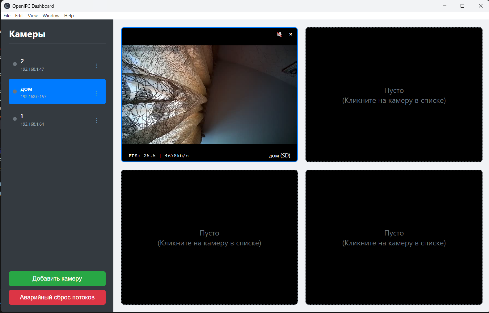

Dashboard

Dashboard is a cross-platform desktop application for easy camera management and monitoring based on the OpenIPC firmware.
The application was created using Electron and provides a single interface for viewing video streams, administering settings, working with the file system, and direct access to the camera's command line.
🚀 Main Features
Multi-view: View up to 64 video streams simultaneously in a customizable grid.
Dual Stream Support: Instantly switch between the main (HD) and secondary (SD) streams.
Full-screen Mode: Detailed full-screen viewing of a single camera with a double-click.
Built-in SSH Client: A full-fledged terminal for direct access to the camera's command line without third-party programs.
File Manager (SCP): A convenient two-panel manager for uploading firmware, downloading recordings, and managing files on the camera.
Settings Editor: A graphical interface for changing all parameters of the Majestic firmware (majestic.yaml), grouped by tabs.
Monitoring: Displays the status (online/offline) and SoC temperature of the camera in real time.
Cross-platform: Works on Windows, macOS, and Linux.
📦 Installation
Ready-to-use installation files for the latest version can be found on the Releases page.
Windows
Download the OpenIPC-Dashboard-Setup-x.x.x.exe file.
Run the installer and follow the instructions.
macOS
Download the OpenIPC-Dashboard-x.x.x.dmg file.
Open the .dmg file and drag the OpenIPC Dashboard.app into your Applications folder.
Linux
Download the OpenIPC-Dashboard-x.x.x.AppImage file.
Make the file executable:
code
Bash
chmod +x OpenIPC-Dashboard-x.x.x.AppImage
Launch the app:
code
Bash
./OpenIPC-Dashboard-x.x.x.AppImage --no-sandbox
🎨 White-Labeling & Branding
The application supports full customization (white-labeling), allowing you to adapt it for your company or clients.
How It Works
On startup, the application looks for a branding.json file in the same directory as its executable file (.exe, .AppImage). If the file is found, the application will apply the custom settings. Otherwise, it will run with the default "DASHBOARD for OpenIPC" branding.
Step-by-Step Guide
Locate the Application Folder: Find the directory where the application's executable is located.
Create branding.json: In that same directory, create a new text file named exactly branding.json.
Configure the File: Open branding.json in a text editor and add your desired settings. See the parameters and examples below.
(Optional) Add Your Logo: If you specified a logoPath, place the logo image file in the same directory.
Launch the Application: Run the executable to see your changes.
Configuration Parameters
Parameter	Type	Description
appName	String	Replaces the default application name.
logoPath	String	Relative path to your logo file (e.g., custom_logo.png). Recommended: 80x80px PNG with transparency.
features	Object	An object to enable or disable specific UI features.
showDonations	Boolean	If false, hides the "Support the Project" section in the "About" tab. Default is true.
showIssueReporting	Boolean	If false, hides the "Report an Issue" button in the settings window. Default is true.
showAboutTab	Boolean	If false, completely hides the "About" tab in the settings window. Default is true.
Example branding.json
code
JSON
{
  "appName": "VMS Pro",
  "logoPath": "vms_pro_logo.png",
  "features": {
    "showDonations": false,
    "showIssueReporting": false,
    "showAboutTab": true
  }
}
Note: Only include the parameters you wish to override. Any omitted parameters will use their default values. The application must be restarted for changes to take effect.
🛠️ For Developers
Technology Stack
Electron
Node.js
HTML, CSS, JavaScript (Vanilla JS)
JSMpeg for video decoding
ssh2 for SSH and SCP
Launching in Development Mode
Clone the repository:
code
Bash
git clone https://github.com/openipc/dashboard.git
cd dashboard
Install the dependencies:
code
Bash
npm install
Launch the app:
code
Bash
npm start
Building the App
To build the installation files for your current platform, run the command:
code
Bash
npm run dist
The finished files will appear in the dist folder.
